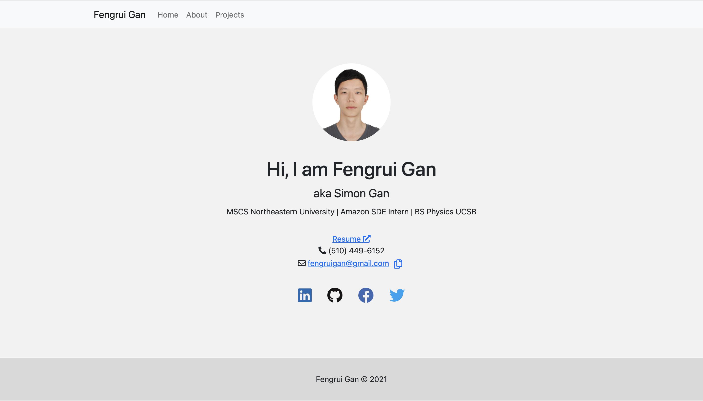

# fengruigan-homepage

This is a basic HTML/CSS/JS project for my personal website. It uses vanilla HTML + CSS + ES6 + Bootstrap.

## Author

Fengrui Gan

## Project Objective

Build a personal homepage with HTML, CSS, JavaScript, and Bootstrap

- [Class Link](https://johnguerra.co/classes/webDevelopment_fall_2021/)
- [Slides](https://docs.google.com/presentation/d/1DUxhcyo_CarS9NEgr0njODvs7eIyj0OoMbYh4yenIsE/edit?usp=sharing)
- [Demo](https://youtu.be/N-JC1o1qzpw)

## Screenshot

## Running locally:

To view this website locally, install _reload_ by running
`npm install -g reload` then run `reload -b` at the project root to open the website in a browser.

To run eslint and prettier, use `npm run checkstyle`

## Resources used:

All icons are from font awesome except for the favicon, which comes from https://monogramframes.com
