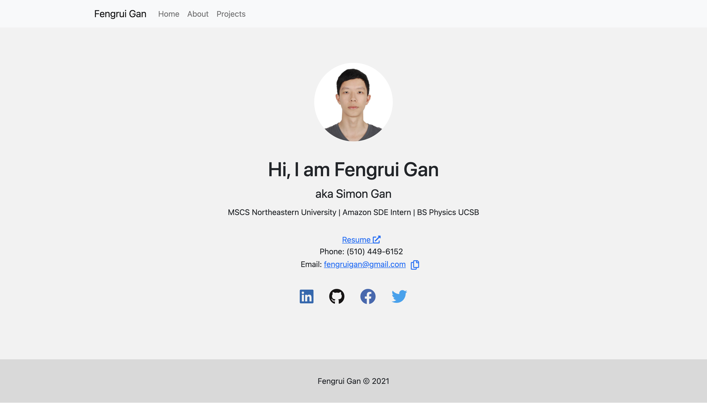

# fengruigan-homepage

## Author

Fengrui Gan

## Class Link

[here](https://johnguerra.co/classes/webDevelopment_fall_2021/)

## Project Objective

Build a personal homepage with bootstrap

## Screenshot

## Running locally:

To view this website locally, install _reload_ by running
`npm install -g reload` then run `reload -b` at the project root to open the website in a browser.

To run eslint and prettier, use `npm run checkstyle`
